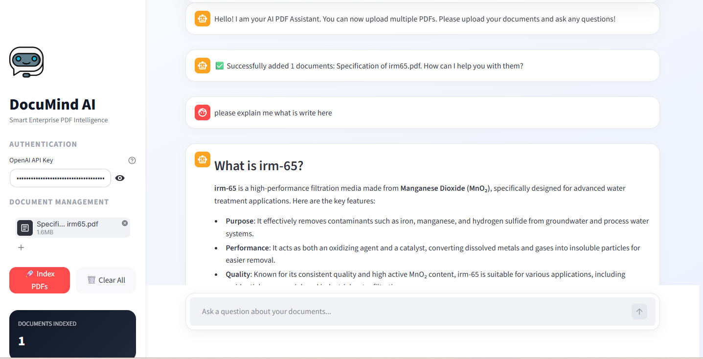
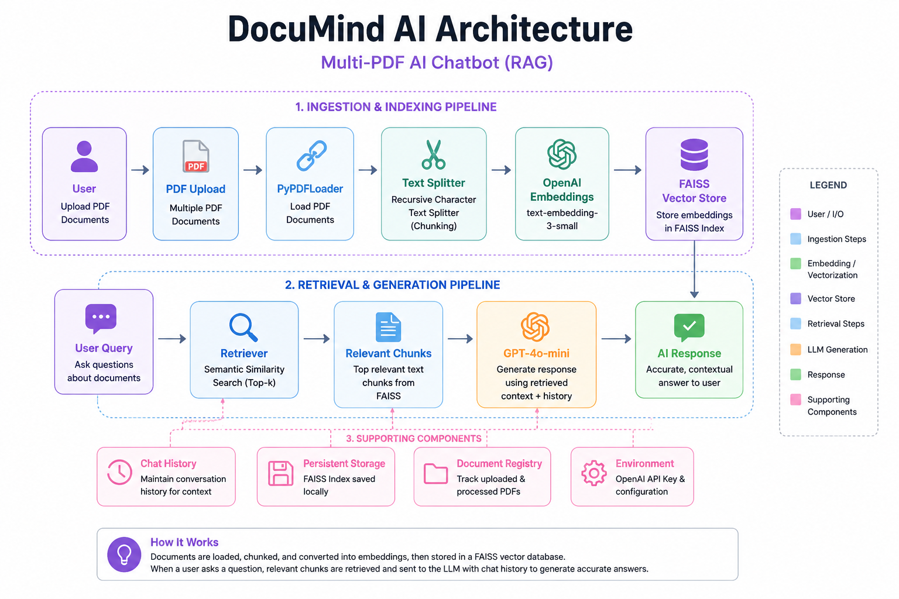

# 🧠 DocuMind AI: Multi-PDF AI Chatbot (RAG)

DocuMind is a professional-grade Retrieval-Augmented Generation (RAG) application that allows users to chat with multiple PDF documents simultaneously. It features persistent storage, conversational memory, and cross-document intelligence.

---

## Preview



## Architecture



## 🚀 Key Features

- **Multi-Document Support:**  
  Upload and index multiple PDFs. The AI understands relationships between different files and can search across all of them.

- **Data Persistence:**  
  Uses FAISS vector database to save embeddings locally. Your knowledge base remains intact even after a restart or page reload.

- **Conversational Memory:**  
  Remembers previous interactions for context-aware follow-up questions, making the chat feel natural.

- **Smart Summarization:**  
  Specifically tuned to provide topic lists and summaries of all information available across the uploaded documents.

- **Modern UI:**  
  Clean, responsive Streamlit interface with professional styling and real-time processing feedback.

---

## 🛠️ Tech Stack

| Technology | Description |
|------------|-------------|
| **Framework** | LangChain (LCEL - LangChain Expression Language) |
| **Language Model** | OpenAI `gpt-4o-mini` |
| **Embeddings** | OpenAI `text-embedding-3-small` |
| **Vector Store** | FAISS (Facebook AI Similarity Search) |
| **Interface** | Streamlit |
| **PDF Parsing** | PyPDF |

---

## 🏗️ How It Works

### 1️⃣ Ingestion
PDFs are loaded and split into small, manageable chunks using `RecursiveCharacterTextSplitter`.

### 2️⃣ Embedding
Each chunk is converted into a high-dimensional vector using OpenAI embedding models.

### 3️⃣ Indexing
Vectors are stored locally in a FAISS index and mapped to their original text.

### 4️⃣ Retrieval
When a user asks a question, the system finds the most relevant chunks using semantic similarity search.

### 5️⃣ Generation
The LLM combines retrieved context, chat history, and the user's question to generate grounded and accurate responses.

---

# 📦 Installation

## 1️⃣ Clone the Repository

```bash
git clone https://github.com/monirwd38/pdf-ai-chatbot
cd pdf-ai-chatbot
```

---

## 2️⃣ Create Virtual Environment

### Windows

```bash
python -m venv venv
venv\Scripts\activate
```

### Linux / macOS

```bash
python -m venv venv
source venv/bin/activate
```

---

## 3️⃣ Install Dependencies

```bash
pip install -r requirements.txt
```

---

## 4️⃣ Run the Application

```bash
streamlit run app.py
```

---

# 📂 Project Structure

```bash
documind-ai/
│
├── app.py                 # Main Streamlit application
├── requirements.txt       # Python dependencies
├── README.md              # Project documentation
├── .gitignore             # Git ignored files
│
├── faiss_index_db/        # Local FAISS vector database
├── chat_history.json      # Saved conversations
└── processed_files.json   # Indexed document registry
```

---

# 📝 Usage

1. Enter your **OpenAI API Key** in the sidebar.
2. Upload one or more PDF documents.
3. Click **"Process PDFs"** to generate embeddings and build the vector store.
4. Start chatting with your documents.
5. Ask:
   - Specific questions
   - Topic summaries
   - Cross-document insights
   - Detailed explanations

---

# 🔥 Example Questions

```text
• Summarize all uploaded documents
• What are the main topics discussed?
• Compare information between these PDFs
• Give me key insights from the files
• Explain chapter 3 in simple terms
```

---

# 📌 Features Included

✅ Multi-PDF Chat  
✅ Conversational Memory  
✅ Persistent Vector Storage  
✅ Smart Summaries  
✅ Cross-Document Search  
✅ Real-Time Streamlit UI  
✅ OpenAI Integration  
✅ FAISS Semantic Search  

---

# 🔐 Environment Variables

Create a `.env` file in the project root:

```env
OPENAI_API_KEY=your_openai_api_key
```

---

# 📄 Requirements

Example dependencies:

```txt
streamlit
langchain
langchain-openai
faiss-cpu
openai
pypdf
python-dotenv
tiktoken
```

---

# 🤝 Contributing

Contributions, issues, and feature requests are welcome.

Feel free to fork the project and submit a pull request.

---

# 📜 License

This project is licensed under the MIT License.

---

# 👨‍💻 Author

### MD. Moniruzzaman

Full Stack Web Developer  
Laravel • React • AI Automation • SaaS Development
